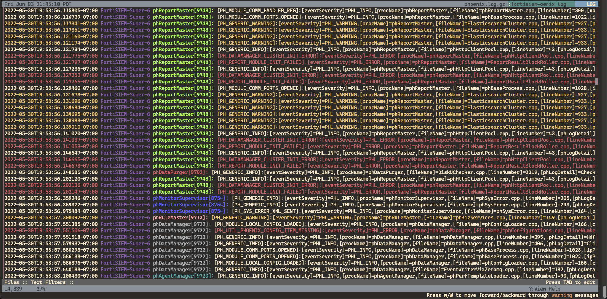

# Log format description files for lnav
http://lnav.org is a powerful log file reader, designed to take multiple log files and order them by date. It understands log file formats using regular expresions and can highlight sections of line, find errors and warnings, and more.

This repository is for the log file format descriptions I've written so far.

# Installation for FortiSIEM Log format
1. Download the log file
2. Install, using lnav

Commands bellow:
```shell
wget https://raw.githubusercontent.com/vlad-infra-admin/lnav-formats/main/fortisiem_phoenix.json
lnav -i fortisiem_phoenix.json

#json file can be removed after install 
rm -f fortisiem_phoenix.json
```

You also can install it manually. Place the log file(`fortisiem_phoenix.json`) in to the directory.
If the dirrectory is not present it will be created. Commands bellow: 
```shell
ls ~/.lnav/formats/installed/ || mkdir -p ~/.lnav/formats/installed/
mv fortisiem_phoenix.json ~/.lnav/formats/installed
```

# Phoenix Log Preview

